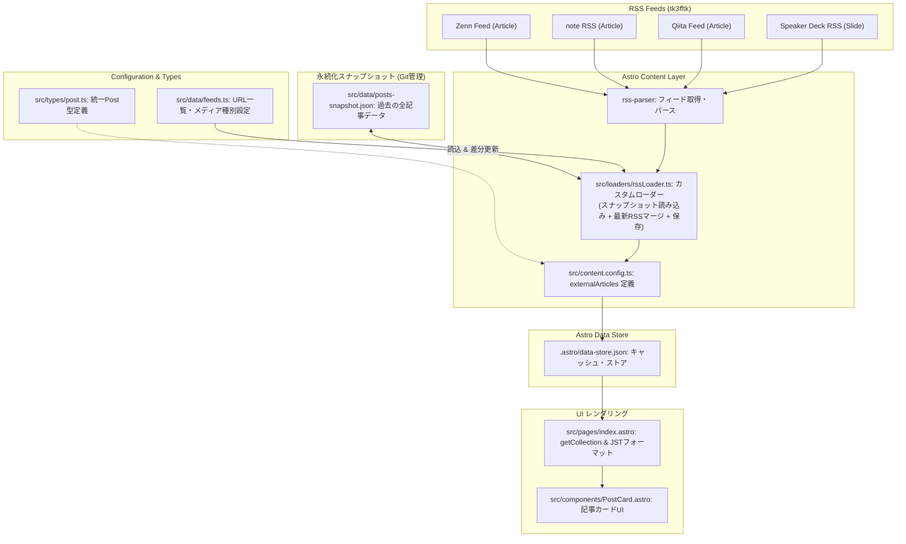

# RSSベース外部記事集約機能 実装計画

## 概要 (Goal Description)

`pN-blog-hub` で実装されていた外部記事（RSS）収集ロジックおよび `docs/plans/00-overall-plan.md` の仕様をベースに、Astro の標準機能である **Content Layer API (`src/content.config.ts`)** を活用した外部記事集約機能を構築します。

RSS フィードは配信上限（最新10〜30件程度）により古い過去記事がフィードから消失するリスクがあるため、本機能では **Git 管理の累加型スナップショット (`src/data/posts-snapshot.json`)** を採用します。ビルド時（`astro build` / `astro dev`）に既存スナップショットを読み込みつつ最新フィードと安全にマージし、過去記事の消失防止・フォールトトレランス・型安全な一覧レンダリングを実現します。

---

## 全体アーキテクチャ & データフロー



---

## 確定した設計方針 & 決定事項 (Confirmed Decisions)

| 項目 | 決定内容 | 理由・背景 |
| :--- | :--- | :--- |
| **コレクション構成** | `externalArticles` コレクションとして独立定義 | Content Layer の責務を分離し、将来の自作ブログ（`blog` コレクション）や手動寄稿記事と疎結合に保つため。 |
| **統一データ型** | `UnifiedPost` インターフェース（`src/types/post.ts`）に準拠 | 将来の統合タイムライン機能実装時にスキーマ再設計の手間を省くため。 |
| **メディア種別** | `contentType: 'article' \| 'slide'` メタデータを保持 | Speaker Deck（スライド）と通常の技術記事をUI・フィルターで識別可能にするため。 |
| **スナップショット永続化** | `src/data/posts-snapshot.json` に累加保存 | RSS配信上限（最新10〜30件）により過去記事が消えるのを防ぎ、永続的に全履歴を保持するため。 |
| **エラーハンドリング** | 個別フィード失敗時はスナップショットを維持して継続 | 外部サービスの障害やオフライン環境でも既存スナップショットを用いてビルドを継続するため。 |
| **ID生成・重複排除** | URL正規化（クエリ削除）＋ハッシュ生成で一意な `id` を作成 | キャッシュキーの安定化および追跡パラメータによる重複登録を防止するため。 |
| **日付処理・表示** | Zod `z.coerce.date()` + `Intl.DateTimeFormat` (Asia/Tokyo, `YYYY-MM-DD`) | 外部依存（Day.js等）を増やさず、JSTでの一貫した日付検証・表示を行うため。 |

---

## 実装計画詳細 (Proposed Changes)

### 1. 依存パッケージ

- `rss-parser`: RSS 2.0 / Atom / RDF フィードを統一的にパースするためのパーサーパッケージ。

---

### 2. データ型定義・フィード設定・スナップショット

#### [NEW] `src/types/post.ts`
- 共通インターフェース `UnifiedPost` を定義。
```typescript
export type PostContentType = 'article' | 'slide';
export type PostSourceType = 'external' | 'blog' | 'manual';
export type PlatformType = 'zenn' | 'note' | 'qiita' | 'speakerdeck' | 'custom';

export interface UnifiedPost {
  id: string;
  title: string;
  url: string;
  pubDate: Date | string;
  contentSnippet?: string;
  postType: PostSourceType;
  contentType: PostContentType;
  platform: PlatformType;
  sourceName: string;
  sourceUrl?: string;
  faviconUrl?: string;
}
```

#### [NEW] `src/data/feeds.ts`
- `tk3fftk` のRSSフィード設定（Zenn, note, Qiita, Speaker Deck）を定義。

#### [NEW] `src/data/posts-snapshot.json`
- 取得済み全記事データを Git 上に保持するスナップショットファイル。
- 過去に取得された記事が RSS から消えてもここに残り続けます。

---

### 3. Astro Content Layer Loader & Collection 設定

#### [MODIFY] `src/loaders/rssLoader.ts`
- スナップショット連動型のカスタム RSS ローダー:
  1. `src/data/posts-snapshot.json` が存在すれば読み込み、初期エントリーマップを作成。
  2. 外部フィード（4ソース）を並列取得。
  3. 新着記事・更新記事を既存マップにマージ（URL正規化・ID生成・日付変換）。
  4. 新着や変更があった場合、`src/data/posts-snapshot.json` を更新保存。
  5. マージ済みの全記事（スナップショット＋最新）を Astro Data Store に `store.set()` で登録。

#### [NEW] `src/content.config.ts`
- `externalArticles` コレクションの定義と Zod スキーマバリデーション。

---

### 4. 仮UI・一覧レンダリングコンポーネント

#### [NEW] `src/components/PostCard.astro`
- 仮デザインの記事カードコンポーネント:
  - タイトル（外部リンク）
  - 出典プラットフォーム名 ＆ ファビコン
  - 種別（Article / Slide）バッジ
  - 投稿日時（`YYYY-MM-DD` JSTフォーマット）
  - スニペット（概要テキスト）

#### [MODIFY] `src/pages/index.astro`
- `getCollection('externalArticles')` で取得した記事一覧を `pubDate` の降順（新しい順）にソートしてレンダリング。
- 記事数・スライド数のサマリーバッジを表示。

---

## 検証手順 (Verification Plan)

### 自動テスト / 静的チェック
1. **型チェック**: `npm run check` (`tsc --noEmit`) がエラーなく完了すること。
2. **Linter / Formatter**: `npm run lint` および `npm run format:check` を実行し、コード品質基準をパスすること。
3. **ビルドテスト**: `npm run build` を実行し、Astro Content Layer が正常に外部RSSとスナップショットをマージして静的HTMLを生成できること。

### スナップショット動作検証
1. `src/data/posts-snapshot.json` が正常に生成・更新されることを確認。
2. オフライン時または個別フィードの一時障害時でも、スナップショットデータをもとに全記事が欠落せずレンダリングされることを確認。
