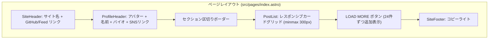

# pN-blog-hub スタイル デザイン刷新 実装計画

## 1. 概要 (Goal Description)

現在のポートフォリオ兼ブログのUIデザインを、社内Hubサイト `pN-blog-hub`（参考URL: `https://pn-blog-hub.tk3fftk.workers.dev/members/tk3fftk`）のダークテーマ・プロフィールヘッダー・カードグリッドレイアウトへ刷新します。
CSSフレームワークとして **Tailwind CSS** を導入し、モダンかつ保守性の高いコンポーネント指向スタイリングを構築します。

---

## 2. 確定仕様 & 決定事項 (Confirmed Decisions & Specifications)

| 項目                 | 決定内容                                                                   | 理由・背景                                                      |
| :------------------- | :------------------------------------------------------------------------- | :-------------------------------------------------------------- |
| **ベースデザイン**   | `pN-blog-hub`（`/members/tk3fftk`）のダークテーマ・カードグリッド          | 世界観の統一と洗練された開発者ポートフォリオUI                  |
| **カラーテーマ**     | **常時ダークテーマ固定**（`#111111` 背景 / `#24242d` カード）              | pN-blog-hub のデザインを忠実に再現し、実装をシンプルに保つ      |
| **設定管理**         | **`src/config/site.ts`** に集約                                            | 名前、Bio、アバターパス、SNSリンク（X, GitHub等）を一箇所で管理 |
| **ヘッダー構成**     | ミニマルなトップナビ（サイト名 + GitHub/Feed リンク）                      | ❌ primeNumber ロゴ、❌ About/Members/Company リンクは排除      |
| **プロフィール**     | 100x100 アバター（`rounded-2xl`）、名前、Bio、SNS角丸ボタン                | pN-blog-hub のメンバーヘッダーを忠実に再現                      |
| **カードレイアウト** | **[左] Favicon + 出典名(zenn.dev等) / [右] 投稿日 + NEWバッジ**            | 著者名は除外し、シンプルでスッキリしたメタデータ構成            |
| **NEW バッジ**       | 投稿から3日以内の記事にパープル（`#9060ff`）バッジを表示                   | pN-blog-hub の新着表示を踏襲                                    |
| **記事一覧表示**     | **初期件数（24件）+ クライアントサイド「LOAD MORE」ボタン**                | pN-blog-hub と同様のページ長コントロールと操作感を実現          |
| **フィルター**       | 現フェーズでは導入しない（将来個別ページ `/blog`, `/articles` に分離予定） | 仕様のシンプル化                                                |

---

## 3. デザイントークン & レイアウト構成

`pN-blog-hub` の SCSS 変数およびカラーパレットを踏襲したトークン設計です。

### デザイントークン一覧

| トークン名                        | カラーコード / 値          | 用途                                       |
| :-------------------------------- | :------------------------- | :----------------------------------------- |
| `--color-base-background`         | `#111111`                  | サイト全体の基本背景色                     |
| `--color-base-background-lighter` | `#24242d`                  | カード背景・SNSボタン・LOAD MOREボタン背景 |
| `--color-base-text`               | `#ffffff`                  | メインテキスト・タイトル                   |
| `--color-base-text-lighter`       | `rgba(212, 231, 241, 0.6)` | サブテキスト・日付・スニペット             |
| `--color-border`                  | `rgba(115, 125, 130, 0.4)` | 区切り線・カード境界・ボタン境界           |
| `--color-primary-background`      | `#9060ff`                  | NEW バッジ背景・アクセント                 |
| `--color-primary-text`            | `#b494ff`                  | ホバー時のタイトルリンク色                 |

---

## 4. 実装計画詳細 (Proposed Changes)

### 1. 設定 & アセット

#### [NEW] `src/config/site.ts`

- サイト全体およびプロフィールのメタデータ定義（名前、Bio、アバターURL、SNSリンク等）。

#### [NEW] `public/avatar.jpg`

- `pN-blog-hub/public/avatars/tk3fftk.jpg` をコピー配置。

#### [MODIFY] `package.json` & `astro.config.mjs`

- `@astrojs/tailwind`（または `@tailwindcss/vite`）をセットアップ。

---

### 2. コンポーネント設計

#### [NEW] `src/components/SiteHeader.astro`

- ミニマルなトップバー（ヘッダー）。
- サイト名（`tk3fftk`）と GitHub / Feed アイコンのみを配置。

#### [NEW] `src/components/ProfileHeader.astro`

- `site.config.ts` からデータを取得し、以下をレンダリング:
  - 100x100 アバター画像（`rounded-2xl`）
  - 名前（`Hiroki Takatsuka`）とサブハンドル（`@tk3fftk`）
  - Bio テキスト
  - SNSリンクボタン（X, GitHub, Feed）

#### [MODIFY] `src/components/PostCard.astro`

- `pN-blog-hub` の `PostLink` に準拠したダークテーマカード:
  - **上部メタ**: [左] Favicon + 出典ドメイン名 / [右] 投稿日 + NEWバッジ
  - **著者名は非表示**
  - **タイトル**: ホバー時に `#b494ff` へ遷移、`line-clamp-2 min-h-[42px]` によりカード間で行数を揃えて統一
  - **概要（スニペット）**: `line-clamp-2 min-h-[32px]` により概要の有無・行差によるカードのガタつきを防止
  - **カードサイズ統一**: `h-full flex flex-col justify-between` で同一行の全カード高さを揃える
  - **NEW バッジ**: 投稿日より3日以内の記事に右上に表示

#### [NEW] `src/components/PostList.astro`

- レスポンシブグリッド（`grid grid-cols-1 sm:grid-cols-2 lg:grid-cols-3 xl:grid-cols-3 gap-4`）
- 各カードアイテムのラッパーに `h-full flex flex-col` を適用し、均一な高さを保証
- 初期24件表示 + 「LOAD MORE」ボタンによる段階的表示制御。

#### [NEW] `src/components/SiteFooter.astro`

- コピーライト付きのシンプルなダークフッター。

#### [MODIFY] `src/pages/index.astro`

- 全体をダークテーマレイアウトとして統合。

---

## 5. 検証手順 (Verification Plan)

### 自動テスト / 静的チェック

1. `npm run check` (`tsc --noEmit`)
2. `npm run lint` および `npm run format:check`
3. `npm run build`

### UI / 動作検証

1. `npm run dev` でローカル確認:
   - 常時ダークテーマ（背景 `#111111`、カード `#24242d`）
   - アバター・SNSリンクを含むプロフィール表示
   - カードメタ情報（Favicon + 出典名 + 日付 + NEWバッジ）
   - 著者名の非表示
   - ヘッダーに不要リンク（primeNumberロゴ, About等）が存在しないこと
   - 「LOAD MORE」ボタンをクリックすると次の記事がスムーズに展開されること
